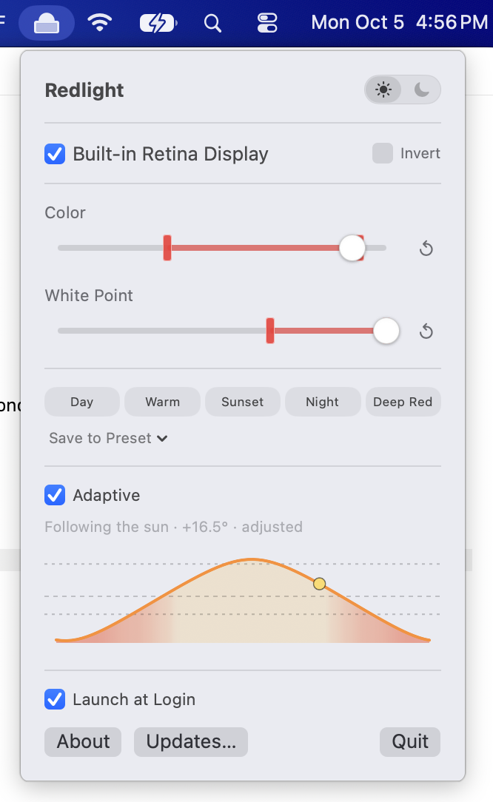

# Redlight

A macOS menu bar app for adjusting screen color and bright whites, with independent control
of each display. Adaptive mode follows the local sun. Use the popover, command line,
Siri/Shortcuts, or a Control Center toggle.

See the [changelog](CHANGELOG.md) for release history.

<p align="center"></p>

## What it does

- **Color slider** goes from **normal screen** (100%) to **pure red** (0%), passing through warm orange tones
- **White Point slider** dims bright areas while leaving darks mostly unchanged — like iOS Reduce White Point but adjustable
- **Adaptive** mode follows real solar elevation: it begins warming before sunset, follows the golden-hour and twilight markers, reaches deepest red at solar midnight, mirrors that back through dawn twilight, and clears to normal within about half an hour of sunrise — set it once and forget it (location stays on your Mac)
- Adaptive eases into its target over two seconds. Turning it off holds the exact output currently on screen as your manual setting, including during a fade; nudges and all four band limits remain available for next time
- Each display checkbox fades that monitor's filter in or out over 0.7 seconds; enabled displays use the same gentle fade when Redlight starts and quits
- **Presets** — one-click Day, Warm, Sunset, Night and Deep Red; **Save to Preset…** then a preset overwrites it with the current sliders. Adaptive uses the same presets as its curve markers, so editing one reshapes the curve
- **Sun arc** — graphs today's solar elevation and the sun's current position. The fill shows the filter level Adaptive applies; dotted guides use the same elevation scale as the curve, with nearby guides omitted to keep them distinct
- **Band limits** — while Adaptive is on, drag the bracket markers on each slider to set a hard min/max the filter can never leave; nudging a slider inside the band shifts the curve's baseline without turning Adaptive off
- **Invert** colors per display (checkbox next to each display) — flips light and dark beneath the red filter
- Per-display toggle — control each monitor independently
- **Light/dark switch** in the popover header flips the system appearance
- Optional **Launch at Login** toggle (off by default, never registered behind your back)
- **Automatic updates** via Sparkle, checked in the background against GitHub releases, plus an **Updates…** button for a manual check
- Remembers your settings across launches
- Restores each display's ColorSync calibration when its filter turns off, and everything on quit
- No dock icon, lives in the menu bar

## New in 1.3

- A master switch that remembers which displays were enabled
- A shared command layer for the popover, CLI, Siri/Shortcuts, and Control Center
- A `redlight` CLI installed automatically when the app runs from Applications
- A Control Center toggle on macOS 26 or later
- Single-instance ownership across copies of the app
- Build numbers that advance automatically and appear consistently in About, CLI output,
  and status

## Using it

Click the menu bar icon (a sun above a monitor) to open the popover:

- Toggle each display on/off, or check **Invert** to flip its colors
- Drag the **Color** slider to control how much blue/green light to remove
- Drag the **White Point** slider to reduce peak brightness without dimming darks
- Click a preset to jump to it; the reset button beside each slider restores its default and clears its band limits
- Flip on **Adaptive** to let the sun drive the filter automatically, then drag the red bracket markers to set its limits; turn it off to hold the current output as your manual setting
- Use the header switch to turn the filter off everywhere, then back on for the displays you had enabled
- The icon's inner screen is 70% opaque with an active filter and 10% opaque when inactive

## Command line

When Redlight runs from `/Applications` or `~/Applications`, it installs a `redlight`
symlink in the first writable directory of `/opt/homebrew/bin` and `/usr/local/bin`.
If neither is writable, opening the popover offers one administrator prompt. Cancelling
leaves the app usable and suppresses future prompts. You can also install the link manually:

```bash
sudo mkdir -p /usr/local/bin
sudo ln -s /Applications/Redlight.app/Contents/MacOS/Redlight /usr/local/bin/redlight
```

Existing files and links to other tools are preserved by automatic installation. The link
points to the app executable and becomes dangling if you delete the app.

```bash
redlight on
redlight color 30
redlight whitepoint 50
redlight preset night
redlight preset save night
redlight adaptive on
redlight limits color 10 80
redlight limits whitepoint 30 90
redlight display list
redlight display 2 on
redlight display "Studio" invert toggle
redlight display all off
redlight appearance dark
redlight login on
redlight status --json
redlight --version
```

`redlight --help` lists every command, including resets, updates and quit. Levels are
percentages matching the popover; display names accept a unique case-insensitive substring.
Applying a preset turns Adaptive off. A level command while Adaptive is on shifts its
baseline within the limits. A valid command that changes app state interrupts an active
slider or band-marker drag, so continuing that drag cannot overwrite it.

`status`, `off` and `quit` leave a stopped app stopped. Other commands launch it as needed;
`toggle` on a stopped app turns it on. Only one app copy can own the displays. If an older
version is already running, quit it before starting this version.

Add `--json` for script output. Exit codes are `0` for success, `1` for invalid input and
`2` for an unavailable app or failed system action. `login on` reports when approval is
needed in System Settings → Login Items.

## Siri, Shortcuts and Control Center

Redlight exposes its commands as actions in Shortcuts, including display selection, preset
editing, limits, system appearance and status. These Siri phrases are provided by the app:

- “Turn on Redlight”
- “Turn off Redlight”
- “Set Redlight to Night” (or another preset)
- “Turn on Redlight Adaptive”

On macOS 26 or later, open **Control Center → Edit Controls → Add Controls**, search for
**Redlight**, and add its toggle. It uses the same master switch and can launch the app when
needed. Quitting restores the
display calibration and publishes the toggle as off while preserving your display selections
for the next launch.

## Install

Download the latest `Redlight-<version>.dmg` from [Releases](../../releases), open it, and drag **Redlight** to `/Applications`. From 1.2 on, installed copies update themselves.

The release is built for Apple silicon only (no Intel). It is not notarized, so the first launch is blocked by Gatekeeper. Either right-click the app and choose **Open** (macOS 14), or open it once, then go to **System Settings → Privacy & Security** and click **Open Anyway** (macOS 15+). Equivalent from a terminal:

```bash
xattr -dr com.apple.quarantine /Applications/Redlight.app
```

To build the current source version:

```bash
git clone https://github.com/andrewfitz/redlight.git
cd redlight
./build.sh
```

This produces `Redlight.app` and `Redlight-<version>.dmg` in the repository root. Quit the
running copy before replacing it in `/Applications`. To keep build artifacts elsewhere:

```bash
REDLIGHT_BUILD_OUTPUT_DIR="$PWD/.build/dist" ./build.sh
```

Each build automatically advances its build number. The release version comes from the
repository's [VERSION](VERSION) file; About shows both values, for example `1.3.1 (47)`.
Update that file when starting a new release, or set `VERSION=1.4` to override it for a build.
CI can set `BUILD_NUMBER` to a positive
integer greater than the previous build; lower or repeated overrides are rejected. The
counter lives in `.build/redlight-build-number.json` and is seeded from Git history and
existing Redlight bundles. Failed build attempts may leave gaps in the sequence.

## Requirements

- A Mac with Apple silicon
- macOS 14 (Sonoma) or later
- Full Xcode.app, with a macOS 26 or later SDK (for building from source and packaging App Intents)

## How it works

Uses CoreGraphics gamma table APIs (`CGSetDisplayTransferByTable`) to modify the display lookup table per display at the GPU level. Red channel stays at full brightness while green and blue channels scale down — blue drops faster than green to produce a warm orange-to-red transition instead of purple. The white point slider applies a custom transfer curve that concentrates brightness reduction on highlights while preserving darks.

No overlay windows, no accessibility permissions, no screen capture. Just gamma tables. (The light/dark switch is the one exception: if the private SkyLight call is unavailable it falls back to System Events, which asks for Automation permission once.)

Adaptive mode adds CoreLocation: it caches an approximate coordinate for offline use, refreshes it occasionally and after wake, and computes the sun's elevation angle locally with a standard NOAA solar algorithm. The filter starts easing at +12°, reaches Warm at +6°, Sunset at 0°, follows the civil/nautical/astronomical twilight boundaries at −6°/−12°/−18°, and reaches Deep Red at solar midnight. Mornings mirror the night up to sunrise, then reach Day by +4° instead of +12°. Where the sun never sinks to −24° (high-latitude summer), the night is stretched so its lowest point still reaches Deep Red. The popover shows the live elevation on its sun arc. Invert is the innermost layer of the same per-display gamma table (`x → 1 − x`), so it composes with the red filter without extra permissions.

## Releasing

Update [VERSION](VERSION) and add the matching version's notes to
[CHANGELOG.md](CHANGELOG.md), then run:

```bash
VERSION="$(cat VERSION)" Tools/release.sh
```

Builds the DMG, generates an EdDSA-signed `appcast.xml` with Sparkle's `generate_appcast`,
and publishes them with an HTML release-note page to GitHub using `gh`. The selected
changelog entry supplies both the GitHub release description and the notes shown in
Sparkle's update dialog. The feed links directly to the hosted HTML asset. Installed copies
poll `releases/latest/download/appcast.xml`. The signing key must be in the login keychain
(Sparkle's `generate_keys`).

## Testing

```bash
swift test
python3 -m unittest discover -s Tools/tests
```

Swift tests cover display behavior with mock gamma, commands, parser and transport,
popover/intent parity, slider interruption, installer safeguards, and solar calculations
and chart geometry. Python tests cover release versions, concurrent build-number
allocation, and changelog release notes. `build.sh` verifies both bundles' metadata, versions, extension entry point,
entitlements, and code signatures.

The ownership subprocess tests currently time out under Xcode 27's SwiftPM test helper.
To run the remaining Swift tests while that launcher issue is unresolved:

```bash
swift test --skip CommandOwnershipTests
```

## License

MIT
